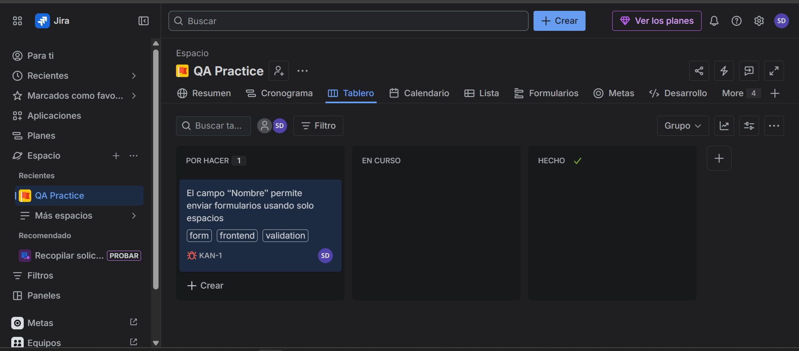
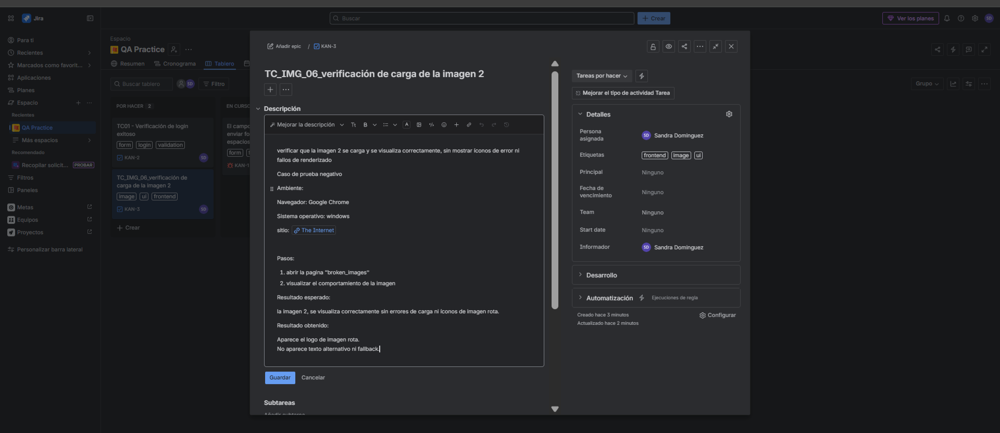
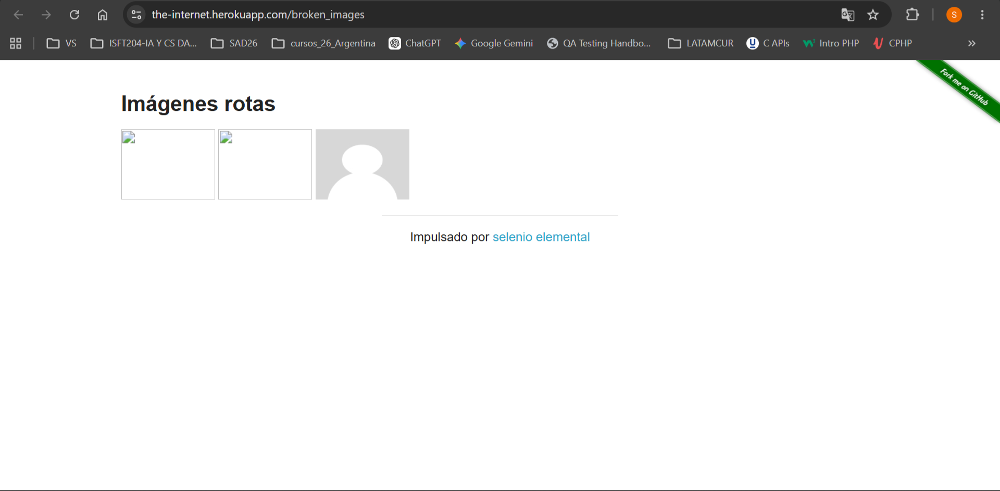
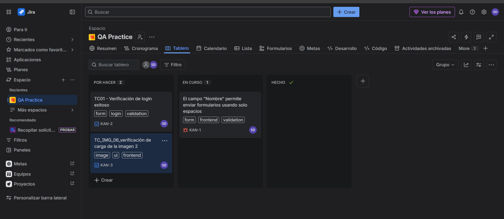

🗺️ Portfolio de QA Manual y Automation: Proyecto "Destino Soñado"

¡Bienvenido/a a mi portfolio de Testing! En este repositorio presento un análisis de calidad integral de punta a punta realizado sobre la plataforma web de turismo **"Destino Soñado"**, un sitio multi-página tradicional que utiliza servicios externos para la gestión de datos, combinado con prácticas avanzadas de automatización en entornos controlados.

El objetivo de este proyecto es demostrar mis habilidades en el relevamiento funcional, análisis de riesgos, diseño/ejecución de casos de prueba, reporte sistemático de defectos (bugs) y desarrollo de scripts de automatización de pruebas funcionales (E2E).

---

## 📊 Resumen Ejecutivo del Proyecto

* **Sitio Bajo Prueba (SUT):** Destino Soñado & The Internet Herokuapp
* **URL del Sitio Principal:** [cac-tpfinal-turismo-completo.netlify.app](https://cac-tpfinal-turismo-completo.netlify.app/)
* **Tipo de Testing:** Manual, Funcional, Caja Negra, Exploratorio y Automatizado.
* **Entorno de Pruebas:** Windows 11 / Google Chrome / Python & Selenium WebDriver.

### 📈 Métricas de Ejecución Manual
* **Casos de Prueba Diseñados:** 20
* **Casos Exitosos (Passed):** 9
* **Casos Fallidos (Failed):** 11
* **Defectos (Bugs) Reportados:** 11

---

## 📂 Estructura del Portfolio

### 🗺️ Proyecto 1: "Destino Soñado" (Pruebas de Extremo a Extremo)
El análisis y la documentación técnica se encuentran dentro de su sección correspondiente:
1. **[Análisis Exploratorio y de Riesgos](./proyecto%20destino-sonado/analisis_exploratorio_inicial_destino_soniado.md):** Mapa funcional del sistema, comportamiento de componentes globales (Navbar, Footer, Formspree), escenarios críticos potenciales y matriz preliminar de riesgos.
2. **[Casos de Prueba y Reporte de Defectos](./proyecto%20destino-sonado/manual_test_cases_contact_form_destino_soniado.md):** Matriz detallada con los 20 escenarios probados en el formulario de contacto junto a la tabla de bugs encontrados clasificados por severidad.

### 🧪 Proyecto 2: "The Internet Herokuapp" (Ejercicios de Práctica QA)
Documentación de diseño de pruebas en entornos de práctica controlados dentro de la carpeta `herokuapp-project`:
1. **[Casos de Prueba Funcionales de Registro](./herokuapp-project/casos_prueba_registro_usuario.md):** Diseño de matriz clásica de pruebas de caja negra enfocada en restricciones de negocio, campos requeridos y formatos de datos.
2. **[Historias de Usuario y Criterios de Aceptación](./herokuapp-project/historias_de_usuario_criterios_aceptacion.md):** Estructuración de requerimientos en formato ágil (User Stories) aplicados a flujos críticos de Login, Autenticación y Logout.
3. **[Casos de Prueba de Imágenes Rotas](./herokuapp-project/casos_prueba_imagenes_rotas.md):** Diseño de escenarios de prueba visuales y de carga de elementos de interfaz para asegurar la integridad de los recursos gráficos.

### 🤖 Proyecto 3: QA Automation (Python + Selenium + Pytest)
Desarrollo de scripts automatizados para la validación de flujos críticos de negocio e interfaces de usuario:
1. **[Automatización del Formulario de Contacto](./qa-automation-contact-form/):** Suite de pruebas enfocada en el SUT *Destino Soñado* para validar el comportamiento del formulario.
2. **[Automatización de Flujos de Login](./qa-automation/):** Scripts de automatización modular enfocados en flujos positivos y negativos sobre el login de Herokuapp.

### 📊 Gestión de Pruebas y Reporte de Bugs
* **Uso de Herramientas Ágiles:** Gestión de ciclos de vida de pruebas y documentación visual del Tablero Kanban directamente detallado en la sección inferior de este documento.

### 📝 Documentación Complementaria de QA
* **[Matriz de Ejercicios Conceptuales - PDF Interactive View](./ejercicios_casos_de_prueba_manual.pdf):** Resolución de guías prácticas adicionales y diseño de escenarios lógicos generales para control de calidad.

---

## 🧠 Destacados Técnicos de la Investigación Manual

Durante el ciclo de pruebas logré identificar fallos críticos en la lógica de negocio y validación del lado del cliente (Client-Side), entre los que se destacan:
* **Bypass de Campos Obligatorios:** El sistema permite el envío del formulario completando el campo "Nombre" únicamente con espacios en blanco (caracteres invisibles).
* **Inconsistencia Temporal:** Falta de validación en componentes de fecha, permitiendo registrar partidas en fechas pasadas o regresos previos a la salida.
* **Falta de Sanitización de Datos:** El campo de teléfono admite caracteres alfabéticos y se permiten archivos adjuntos de formatos no permitidos (ej. PDFs en campos destinados a imágenes de DNI).

---

## 🛠️ Gestión de Pruebas con Jira (Tablero Kanban)

Para la gestión del ciclo de vida del testing, la organización de las tareas y el reporte de defectos, utilicé **Jira Software**, aplicando la metodología **Kanban** dentro del proyecto **"QA Practice"**.

### 📋 Estructura del Tablero
El flujo de trabajo se dividió en estados principales para mantener una visibilidad clara del progreso:
* **Por Hacer (To Do):** Casos de prueba diseñados listos para ser ejecutados o re-testeados.
* **En Curso (In Progress):** Defectos detectados que se encuentran bajo revisión o reporte detallado.
* **Hecho (Done):** Tareas finalizadas con éxito.

### 🔍 Casos de Prueba y Reporte de Bugs Detallados

A continuación, se presentan los tickets gestionados en la herramienta, los cuales incluyen la definición del ambiente, pasos de reproducción, resultados esperados y adjuntos de evidencia:

#### 1. 🟢 TC01 - Verificación de Login Exitoso (Caso de Prueba Positivo)
* **ID:** KAN-2
* **Estado:** Por Hacer
* **Componentes / Etiquetas:** `form`, `login`, `validation`
* **Descripción:** Validación del flujo principal de inicio de sesión utilizando credenciales válidas (`tomsmith` / `SuperSecretPassword!`).
* **Evidencia asociada:** Se incluye como archivo adjunto la captura de la interfaz de login configurada correctamente.


#### 2. 🔴 Bug: El campo "Nombre" permite enviar formularios usando solo espacios (Defecto de Validación)
* **ID:** KAN-1
* **Estado:** En Curso
* **Componentes / Etiquetas:** `form`, `frontend`, `validation`
* **Descripción:** Se detectó un comportamiento incorrecto en el formulario de la sección "Inicio - Viajes". El sistema permite procesar de manera exitosa el envío cuando el campo obligatorio "Nombre" contiene únicamente espacios en blanco, omitiendo la validación de datos válidos.
* **Resultado Esperado:** El sistema debe rechazar espacios vacíos y mostrar un mensaje de validación de campo requerido.
* **Resultado Actual:** El formulario se envía correctamente con información inválida.




#### 3. 🔵 TC_IMG_06 - Verificación de carga de la imagen 2 (Caso de Prueba Negativo / Bug)
* **ID:** KAN-3
* **Estado:** Por Hacer
* **Componentes / Etiquetas:** `image`, `ui`, `frontend`
* **Descripción:** Comprobación de que las imágenes de la sección `broken_images` se renderizan de forma correcta en el navegador Google Chrome sobre Windows.
* **Resultado Esperado:** La imagen 2 se visualiza correctamente sin errores de carga ni íconos de imagen rota.
* **Resultado Actual:** Aparece el logo de imagen rota en el frontend. No se presenta texto alternativo (alt) ni un fallback adaptativo.




### 📸 Vista General del Tablero Kanban

En esta captura se aprecia el estado del proyecto **QA Practice**, reflejando la distribución de los tickets de prueba y los bugs reportados en sus respectivas columnas de flujo.



---

## 🤖 Automatización de Pruebas (QA Automation)

Con el fin de agilizar los ciclos de regresión y asegurar la estabilidad de las funcionalidades críticas, diseñé suites de pruebas automatizadas utilizando **Python**, **Selenium WebDriver** y el framework **Pytest**.

### 💻 1. Automatización del Formulario de Contacto (`qa-automation-contact-form`)
Esta suite de pruebas está orientada al frontend del SUT *Destino Soñado*, estructurada de forma modular mediante aserciones avanzadas.

* **Manejo de Ciclo de Vida:** Uso de `@pytest.fixture` para inicializar y destruir de forma segura las instancias de Chrome WebDriver (`driver.quit()`).
* **Estrategias de Captura:** Validación de alertas nativas de JavaScript (`driver.switch_to.alert`) y mensajes de restricción HTML5 (`get_attribute("validationMessage")`).

```python
# Validación nativa del navegador (HTML5 requerido) en test_contact_form.py
def test_form_nombre_vacio(driver):
    completar_form(driver, "", "Dominguez", "22345123", "sandramarmdq@gmail.com")
    enviar_form(driver)
    
    campo_nombre = driver.find_element(By.ID, "nombre")
    mensaje = campo_nombre.get_attribute("validationMessage")
    assert "Completa este campo" in mensaje
